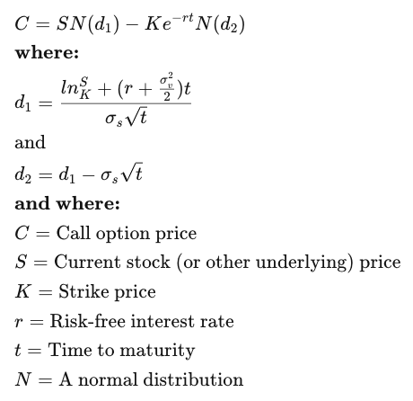

# Black-Scholes Option Pricing Streamlit App

## Overview
This Streamlit app allows users to explore the **Black-Scholes model** for option pricing. It provides interactive widgets for input variables and visualizes the resulting option prices using a **Seaborn heatmap**.

The app is designed to help users understand how key parameters—such as stock price, strike price, volatility, and risk-free rate—impact option pricing.

---

## Features
- ** **: 
- ** **:
- ****:

---

# Black-Scholes Option Pricing Formula

Below is the mathematical representation of the option pricing model.

