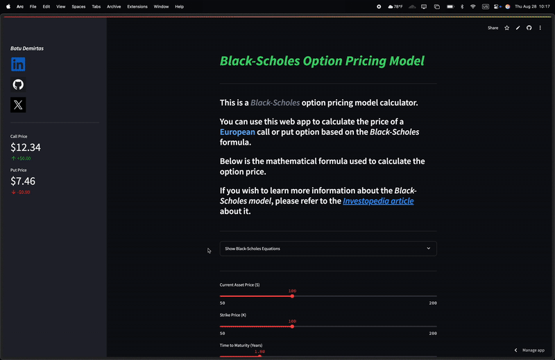
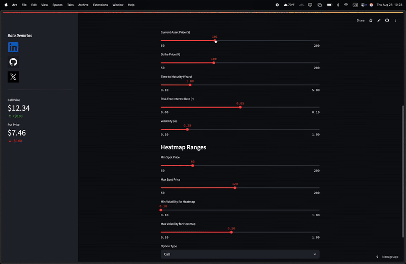
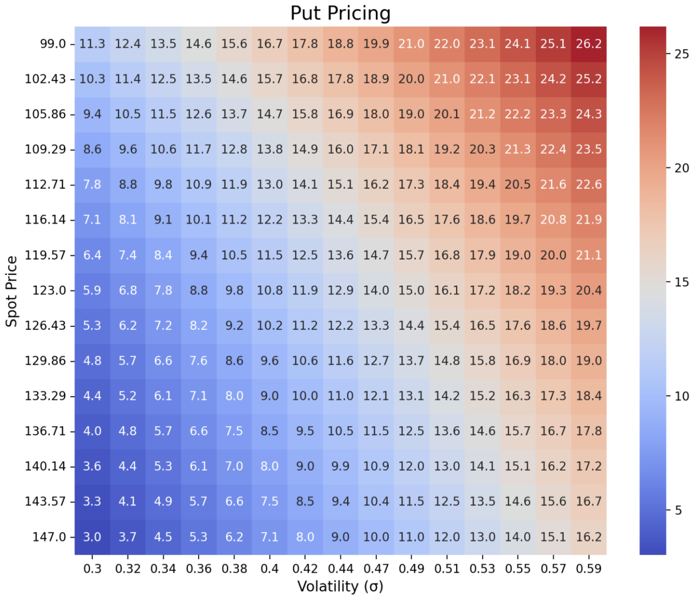
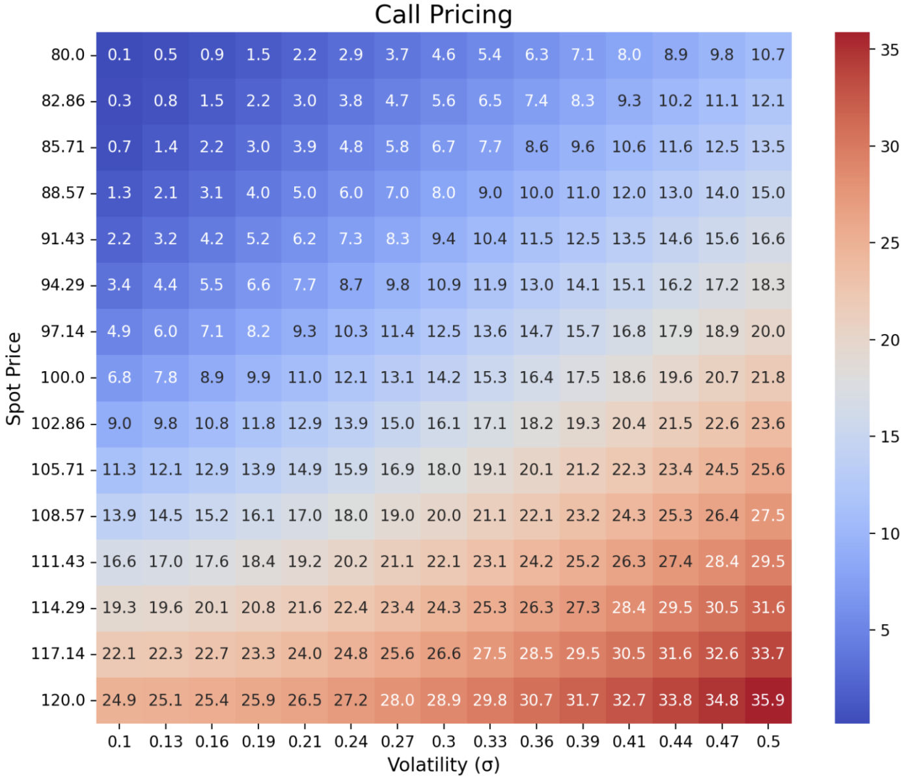
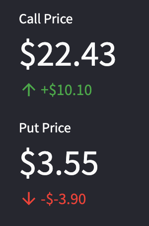
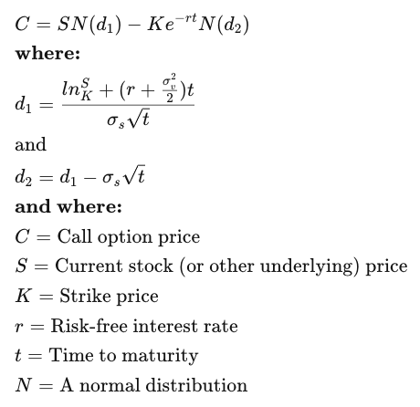

# Black-Scholes Option Pricer

## Overview
This app allows users to explore the ***Black-Scholes model*** for pricing European options. With a **beginner-friendly UI**, it provides interactive widgets for all input variables and visualizes the resulting option prices using dynamic heatmaps.

The app is designed to help users understand how key parameters—such as stock price, strike price, volatility, and risk-free rate—impact option pricing.

---

## 🚀 [Click Here for the Live Application](https://blackscholesoptionpricer.streamlit.app/)

---

## App Preview

The interface is designed to be intuitive. Simply choose an option type from the dropdown menu and adjust the sliders to see how the option's price changes in real-time.

  
   
  <em>Select either a Call or Put option to begin.</em>

  
   
  <em>Adjust financial parameters like volatility and interest rates with simple sliders.</em>

---

## The results are instantly visualized in a heatmap and compared directly in a summary table.

  
  
   
  <em>Dynamic heatmaps for both Put (left) and Call (right) options.</em>

  
   
  <em>And topped off with an easy to follow comparison in USD$.</em>

---

## The Black-Scholes Formula

> The Black-Scholes model, developed by Fischer Black and Myron Scholes, revolutionized options pricing in finance. Later, Robert Merton expanded upon their work by introducing mathematical refinements and applying the model more broadly. Together, the Black-Scholes-Merton framework became the cornerstone of modern financial theory...

### Mathematical Formula

  

To learn more about the math behind the model, see [**Wikipedia**](https://en.wikipedia.org/wiki/Black%E2%80%93Scholes_model) or [**Investopedia**](https://www.investopedia.com/terms/b/blackscholes.asp).

---

## Tech Stack
* **Framework:** [Streamlit](https://streamlit.io/)
* **Data Manipulation:** [NumPy](https://numpy.org/) & [Pandas](https://pandas.pydata.org/)
* **Visualization:** [Seaborn](https://seaborn.pydata.org/) & [Matplotlib](https://matplotlib.org/)
* **Financial Computation:** [SciPy](https://scipy.org/)
